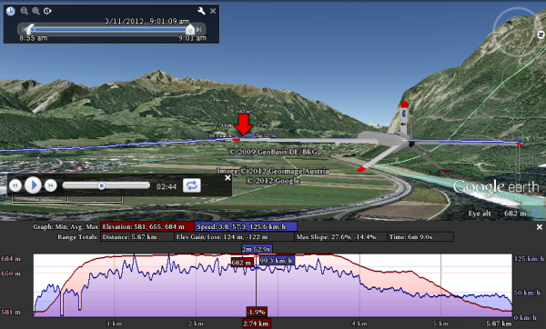

---
---

# HTTP Server

The GCS app has built-in HTTP server (listening on port **9280**).

Server capabilities include:

* Provide datalink stream to other GCS components;
* Control any particular Mandala variable;
* Execute JavaScript commands;
* Reply requested Mandala variable value;
* [Google Earth](http://earth.google.com) real-time flight visualization and analyzis of telemetry data;

To see the server welcome message - start the GCS and open this link in browser: [`http://127.0.0.1:9280`](http://127.0.0.1:9280)

## Multiple GCS operation

The GCS can connect remotely to another GCS datalink through TCP connection. Each GCS instance creates server and accepts external connections.

When GCS finds another server in local network, it appears under menu `Preferences/Datalink/Remote servers` and can be used for datalink connection. Moreover, the direct connection could be set-up with the `Preferences/Datalink/Local Ports`.

## VPN Support

Datalink server has the capability to establish connection through internet with another GCS.

Two or more GCS interfaces could be connected to one or more datalink modems. the connection requires **static ip**, thus VPN connection is recommended.

To request for online support for tuning or troubleshooting, [contact us](/contacts.md) to receive credentials to access our network.

## Mandala control

The HTTP server will accept any request beginning with `/mandala`. The request parameters are following `?` char, and are optional. Several request parameters can be combined in one request and separated by the `&` sign.

The following parameters are accepted:

* `<variable name>` - will return it's value, f.ex. `?ctr.str.brake`;
* `<variable name>=<value>` - will set the new value and send it to UAV;
* `descr` - variables will be returned with their descriptions;
* `scr=<JS script>` - will evaluate JS script in the application context;

For example, assuming you run GCS on the local machine, the following requests are valid:

* [http://127.0.0.1:9280/mandala](http://127.0.0.1:9280/mandala) - will return xml list of all variables and their current values;
* [http://127.0.0.1:9280/mandala?descr](http://127.0.0.1:9280/mandala?descr) - same as above, but will include descriptions;
* [http://127.0.0.1:9280/mandala?descr&cmd.pos.altitude&est.att.roll](http://127.0.0.1:9280/mandala?descr&md.pos.altitude&est.att.roll) - will return only two values specified, with descriptions;
* [http://127.0.0.1:9280/mandala?cmd.pos.altitude=1000&est.att.roll](http://127.0.0.1:9280/mandala?cmd.pos.altitude=1000&est.att.roll) - will set commanded altitude to 1km and return current values;
* [http://127.0.0.1:9280/mandala?cmd.proc.mode=proc_mode_TAKEOFF](http://127.0.0.1:9280/mandala?cmd.proc.mode=proc_mode_TAKEOFF) - this will change current mode to TAKEOFF procedure;
* [http://127.0.0.1:9280/mandala?scr=cmd.proc.mode=proc_mode_EMG](http://127.0.0.1:9280/mandala?scr=cmd.proc.mode=proc_mode_EMG) - will execute a JS script to change current mode to manual control;
* [http://127.0.0.1:9280/mandala?scr=ctr.str.brake=trigger(ctr.str.brake,0,1)](http://127.0.0.1:9280/mandala?scr=ctr.str.brake=trigger(ctr.str.brake,0,1)) - toggle parking brakes by script;
* [http://127.0.0.1:9280/mandala?scr=btn_BRAKE()](http://127.0.0.1:9280/mandala?scr=btn_BRAKE()) - toggle parking brakes by calling function defined in `gcs.js`;

## Google Earth Visualization

Add the following link to Google Earth:

`http://<IP address of GCS machine>:9280/kml`

.. i.e. if you run both the GCS and GoogleEarth on the same machine, use:

`http://127.0.0.1:9280/kml`

